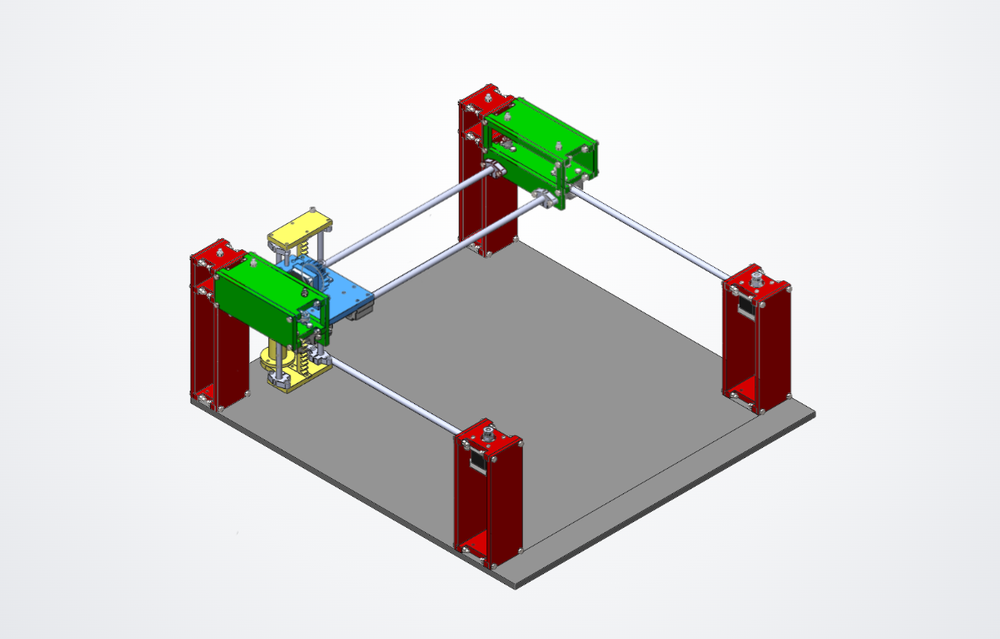
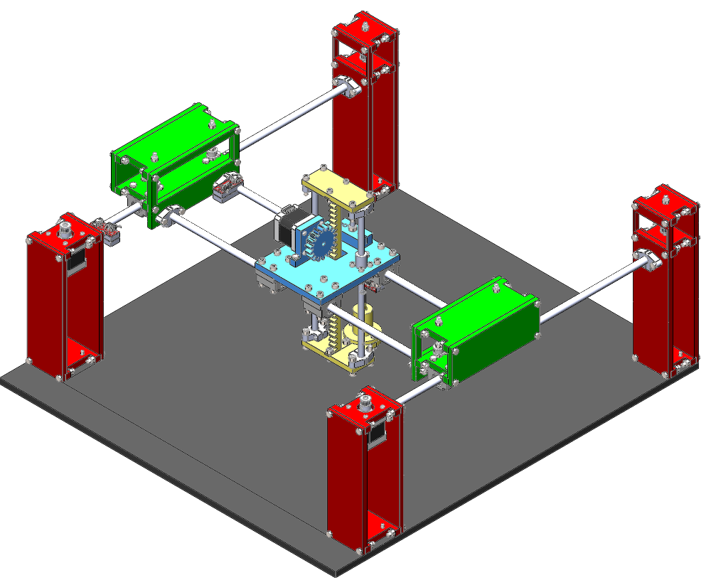
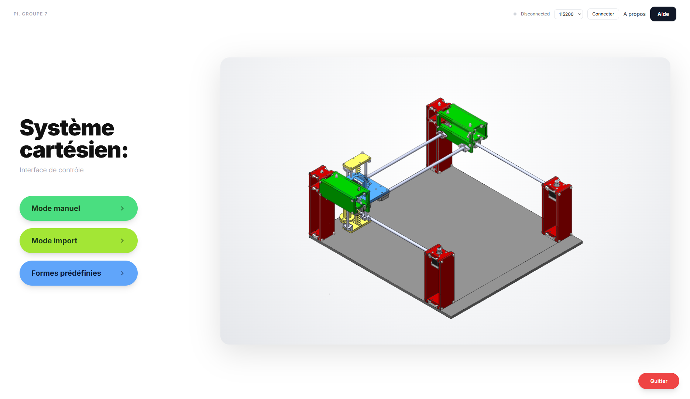
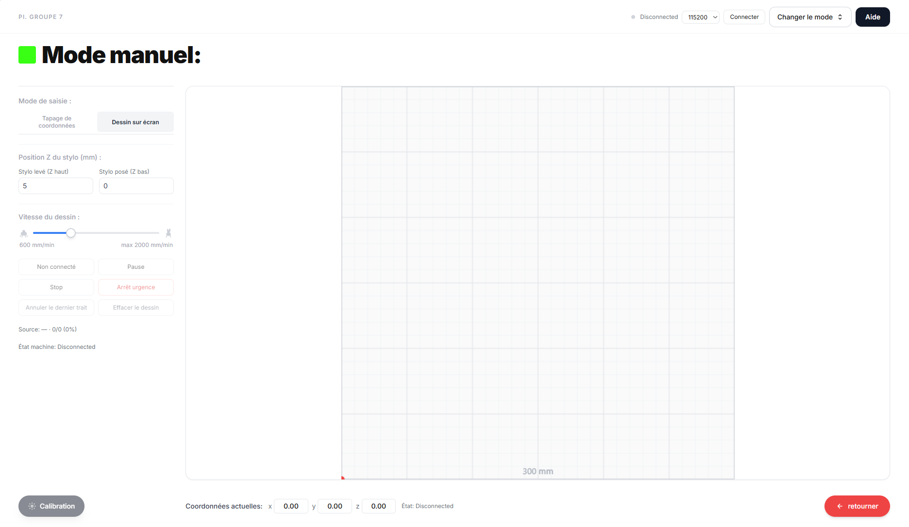
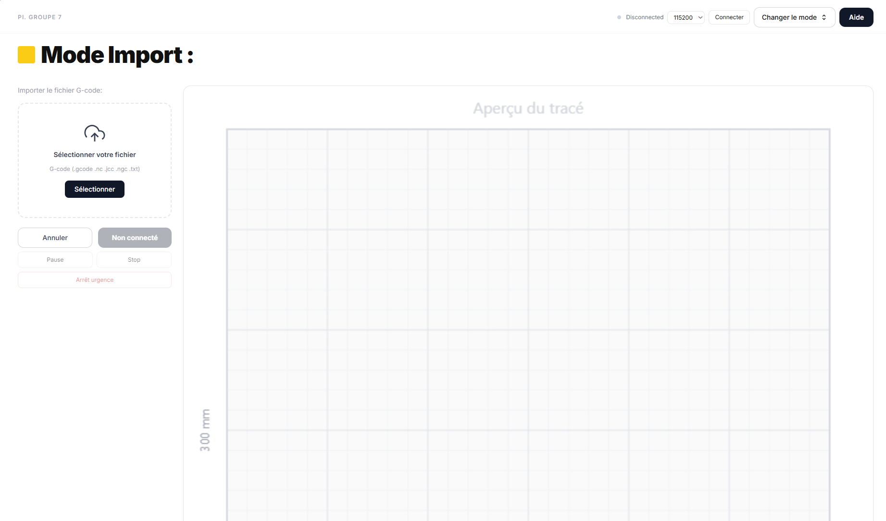
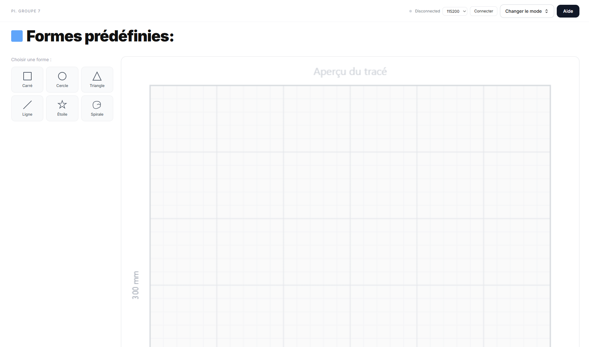
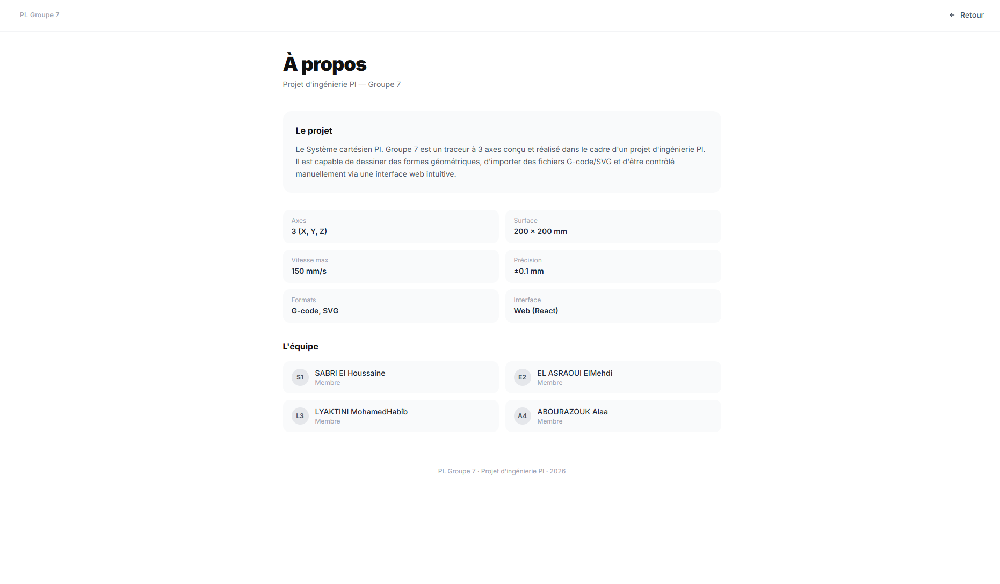

# 🖊️ DRAWBOT — Système Cartésien PI. Groupe 7

Interface web de contrôle pour un traceur cartésien (CNC pen plotter) à 3 axes, basé sur GRBL. L'application communique directement avec la carte contrôleur via le **Web Serial API**, sans backend ni installation de driver supplémentaire.

<p align="center">
  
</p>

<p align="center">
  <em>Prototype physique du traceur cartésien réalisé dans le cadre du projet</em>
</p>

---

## 📋 Sommaire

- [Aperçu](#-aperçu)
- [Animation de la machine (page d'accueil)](#-animation-de-la-machine-page-daccueil)
- [Fonctionnalités](#-fonctionnalités)
- [Captures d'écran](#-captures-décran)
- [Stack technique](#-stack-technique)
- [Architecture du projet](#-architecture-du-projet)
- [Installation](#-installation)
- [Démarrage](#-démarrage)
- [Connexion à la machine](#-connexion-à-la-machine)
- [Équipe](#-équipe)

---

## 🎯 Aperçu

Le **Système cartésien PI. Groupe 7** est un traceur à 3 axes (X, Y, Z) conçu et réalisé dans le cadre d'un projet d'ingénierie. Il est capable de :

- dessiner des formes géométriques prédéfinies (carré, cercle, triangle, étoile, spirale…) ;
- importer et exécuter des fichiers G-code ;
- être piloté manuellement, soit par saisie de coordonnées, soit par dessin libre à l'écran ;

le tout via une interface web moderne, réactive et animée, connectée en temps réel à la carte GRBL de la machine.

<p align="center">
  
</p>

<p align="center">
  <em>Conception de la plateforme mécanique (CAO)</em>
</p>

---

## 🎬 Animation de la machine (page d'accueil)

La page d'accueil ne montre pas une simple photo statique : c'est une **animation en temps réel** du plotteur, reconstruite à partir de calques PNG transparents qui se déplacent exactement comme les pièces mobiles de la vraie machine.

### Principe

Le modèle 2D est découpé en **couches empilées** (`z-index`), chacune correspondant à un sous-ensemble mécanique réel :

| Couche | Élément représenté | Axes qui la font bouger |
|---|---|---|
| Bâti + plateau (`frame.png`) | Structure fixe | — (immobile) |
| Traverses vertes (`green-left/right.png`) | Portique CoreXY | **Y** |
| Chariot bleu (`blue.png` + overlays moteur) | Chariot porteur | **X + Y** |
| Ensemble Z jaune (`z-assembly.png`) | Axe Z + porte-stylo | **X + Y + Z** |
| Tours support (`lower-towers.png`) | Colonnes avant-plan | — (immobile, au premier plan) |

À chaque mise à jour des coordonnées machine (`coords.x`, `coords.y`, `coords.z`, remontées en direct depuis GRBL toutes les 250 ms), le composant `MachineAnimation.jsx` recalcule la position de chaque calque et lui applique une translation CSS (`transform: translate(...)`), avec une transition douce de 180 ms pour lisser le mouvement.

### Calcul de la position (`src/lib/animation.js`)

1. **Vecteurs directionnels (`MOTION_AXES`)** — chaque axe machine (X, Y, Z) est projeté sur un vecteur 2D à l'écran, pour respecter la perspective isométrique du dessin (ex. l'axe Y avance en diagonale vers le bas-droite, l'axe Z remonte verticalement).
2. **Plage native (`AXIS_RANGE`)** — chaque axe a une plage calibrée (ex. X : −200 → 100, Y : −250 → 30, Z : 0 → 100) reprise du panneau de contrôle de l'animation d'origine, afin que le modèle atteigne visuellement les mêmes butées que la machine réelle.
3. **Mise à l'échelle (`nativeValue`)** — la coordonnée réelle envoyée par la machine (0 → course max, en mm) est remise à l'échelle linéairement sur cette plage native.
4. **Composition des calques (`offsetsFromCoords`)** — les offsets de chaque axe sont combinés pour obtenir le déplacement final de chaque couche :
   - traverses vertes → déplacement **Y** seul ;
   - chariot bleu → **Y + X** ;
   - ensemble Z jaune → **Y + X + Z**.
5. **Conversion en pourcentage (`toLayerStyle`)** — les offsets (exprimés en unités de la scène `1617 × 1035 px`) sont convertis en pourcentage de la taille du conteneur, pour que l'animation reste fluide et responsive à n'importe quelle taille d'écran.

> 💡 En résumé : quand la tête d'impression bouge réellement sur la machine, l'illustration sur la page d'accueil bouge avec elle, calque par calque, sans vidéo ni sprite-sheet — juste des translations CSS pilotées par les coordonnées GRBL live.

---

## ✨ Fonctionnalités

### 🏠 Page d'accueil
- Vue d'ensemble du système avec animation en temps réel de la position de la tête d'impression.
- Connexion / déconnexion série (Web Serial API) avec choix du baud rate.
- Indicateur d'état de la machine (`Idle`, `Run`, `Alarm`…) en direct.
- Accès rapide aux trois modes de fonctionnement.

### ✍️ Mode manuel
- **Tapage de coordonnées** : saisie précise de positions X / Y / Z, empilées en séquence puis envoyées à la machine.
- **Dessin sur écran** : tracé libre à la souris/tactile, converti automatiquement en G-code.
- Réglage de la vitesse d'avance (% → mm/min) et des hauteurs de stylo (levé / posé).
- Aperçu du tracé avant envoi, avec barre de coordonnées en direct.

### 📂 Mode import
- Import de fichiers G-code par glisser-déposer ou sélection (`.gcode`, `.nc`, `.jcc`, `.txt`).
- Parsing et nettoyage automatique des lignes (suppression des commentaires `;` et `(...)`, filtrage des commandes non supportées M6/M7/M8/M9…).
- Prévisualisation du tracé XY avant lancement de l'impression.
- Suivi des coordonnées machine en temps réel pendant l'exécution.

### 🔷 Formes prédéfinies
- Bibliothèque de formes géométriques prêtes à tracer : carré, cercle, triangle, ligne, étoile, spirale.
- Paramètres ajustables par forme (dimensions, rayon, angle, nombre de pointes, espacement des spires…).
- Génération automatique du G-code correspondant.

### 🛠️ Fonctions transverses
- **Calibration** : positionnement de l'origine (0, 0, 0) avant chaque session, disponible sur chaque page de mode.
- Contrôle du flux d'impression : pause / reprise / arrêt / **arrêt d'urgence**.
- Déverrouillage (`unlock`) et gestion des alarmes GRBL.
- Page **Aide & FAQ** couvrant la prise en main de l'interface.
- Page **À propos** présentant le projet et l'équipe.

---

## 📸 Captures d'écran

<table>
  <tr>
    <td align="center" width="50%">
      <br/>
      <sub><b>Accueil</b> — vue d'ensemble et animation de la machine</sub>
    </td>
    <td align="center" width="50%">
      <br/>
      <sub><b>Mode manuel</b> — saisie de coordonnées / dessin sur écran</sub>
    </td>
  </tr>
  <tr>
    <td align="center" width="50%">
      <br/>
      <sub><b>Mode import</b> — import et prévisualisation de G-code</sub>
    </td>
    <td align="center" width="50%">
      <br/>
      <sub><b>Formes prédéfinies</b> — bibliothèque de formes paramétrables</sub>
    </td>
  </tr>
  <tr>
    <td align="center" colspan="2">
      <br/>
      <sub><b>À propos</b> — présentation du projet et de l'équipe</sub>
    </td>
  </tr>
</table>

---

## 🧱 Stack technique

| Technologie | Rôle |
|---|---|
| **React 19** | Librairie UI |
| **Vite 8** | Bundler & serveur de développement |
| **React Router v7** | Navigation multi-pages |
| **Tailwind CSS v3** | Styles utilitaires |
| **Framer Motion** | Animations d'interface |
| **Web Serial API** | Communication série directe navigateur ↔ carte GRBL |

---

## 🗂️ Architecture du projet

```
src/
├── components/
│   ├── CalibrationButton.jsx    # Bouton de calibration (retour origine)
│   ├── CartesianGrid.jsx        # Grille de dessin cartésienne
│   ├── CoordBar.jsx             # Barre d'affichage des coordonnées live
│   ├── DrawingCanvas.jsx        # Canvas de dessin libre (mode manuel)
│   ├── MachineAnimation.jsx     # Animation temps réel de la machine
│   ├── ModeDropdown.jsx         # Sélecteur de sous-mode
│   ├── PageHeader.jsx           # En-tête commun aux pages de mode
│   ├── PreviewCanvas.jsx        # Prévisualisation du tracé G-code
│   ├── Sidebar.jsx               # Barre latérale (paramètres/contrôles)
│   └── TopBar.jsx                # Barre supérieure
├── context/
│   └── GrblContext.jsx          # État global GRBL (connexion série, coords, workspace…)
├── lib/
│   ├── animation.js             # Logique d'animation de la machine
│   └── grbl.js                  # Génération G-code, parsing GRBL, réglages machine
├── pages/
│   ├── Home.jsx                 # Accueil
│   ├── ModeManuel.jsx            # Mode manuel
│   ├── ModeImport.jsx            # Mode import
│   ├── FormesPredefinies.jsx     # Formes prédéfinies
│   ├── Aide.jsx                  # Aide & FAQ
│   └── APropos.jsx               # À propos
├── App.jsx                      # Déclaration des routes
└── main.jsx                     # Point d'entrée
```

### Routes disponibles

| Route | Description |
|-------|-------------|
| `/` | Accueil — Système cartésien |
| `/manuel` | Mode Manuel (saisie de coordonnées ou dessin sur écran) |
| `/import` | Mode Import (G-code) |
| `/formes` | Formes Prédéfinies |
| `/aide` | Aide & FAQ |
| `/apropos` | À propos du projet |

---

## ⚙️ Installation

```bash
git clone <url-du-repo>
cd interface
npm install
```

## 🚀 Démarrage

```bash
npm run dev        # serveur de développement → http://localhost:5173
npm run build      # build de production
npm run preview    # prévisualisation du build
npm run lint       # vérification ESLint
```

> ⚠️ Le Web Serial API n'est disponible que sur les navigateurs basés Chromium (Chrome, Edge, Opera) et nécessite une connexion sécurisée (`https://` ou `localhost`).

---

## 🔌 Connexion à la machine

1. Brancher la carte GRBL (ATmega2560 / CoreXY) en USB.
2. Depuis la page d'accueil, choisir le **baud rate** (115200 par défaut) puis cliquer sur **Connecter**.
3. Le navigateur demande de sélectionner le port série correspondant.
4. Une fois connecté, l'état de la machine (`Idle`, `Run`, `Alarm`, `Home`…) et les coordonnées s'affichent en temps réel.
5. Effectuer une **calibration** avant tout premier tracé.

---

## 👥 Équipe

Projet d'ingénierie **PI — Groupe 7**

- SABRI El Houssaine
- EL ASRAOUI ElMehdi
- LYAKTINI MohamedHabib
- ABOURAZOUK Alaa

---

<p align="center"><sub>EMINES School of Industrial Management — UM6P</sub></p>
